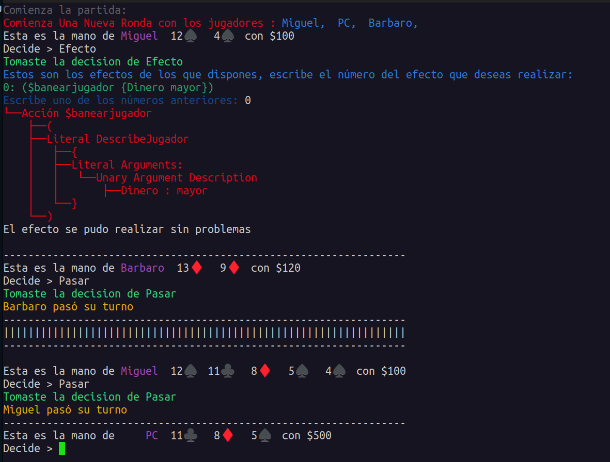

## Ejemplo 1:

En este ejemplo Miguel usa el efecto de banear descrito como el que más dinero posee, notemos que es *PC* y que su turno fue pasado en la primera mini-ronda, después juega normalmente.