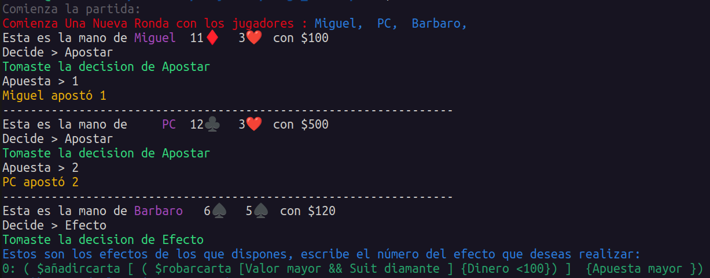
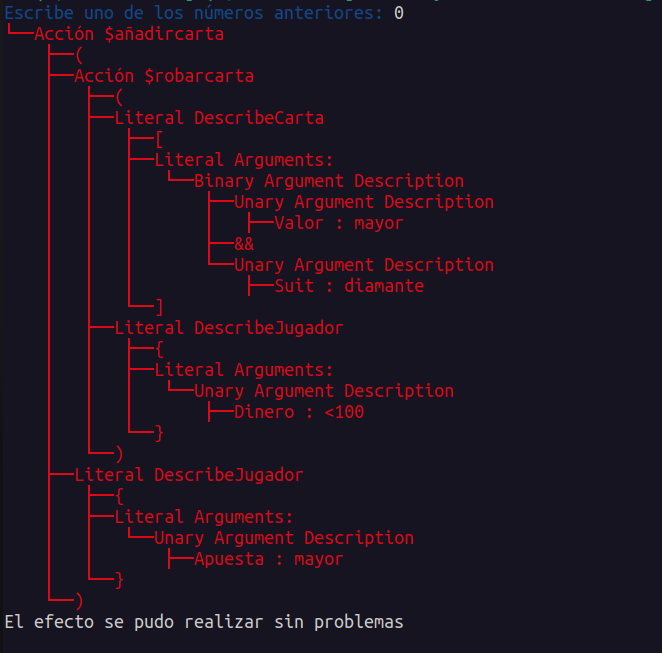
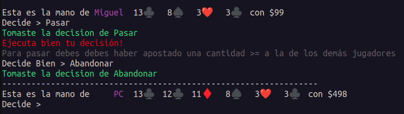

# Ejemplo 2:

En este ejemplo el jugador Barbaro usa el efecto de que añadir-carta, la carta que va a añadir es el resultado de otro efecto que es el de robarle la carta de mayor valor y de diamante al jugador que posea menos de $100, finalmente le añadimos la carta obtenida al jugador que más haya apostado.

Como se puede observar ahora *Miguel* no posee el *11 de diamantes* y si lo psee el jugador *PC*.
